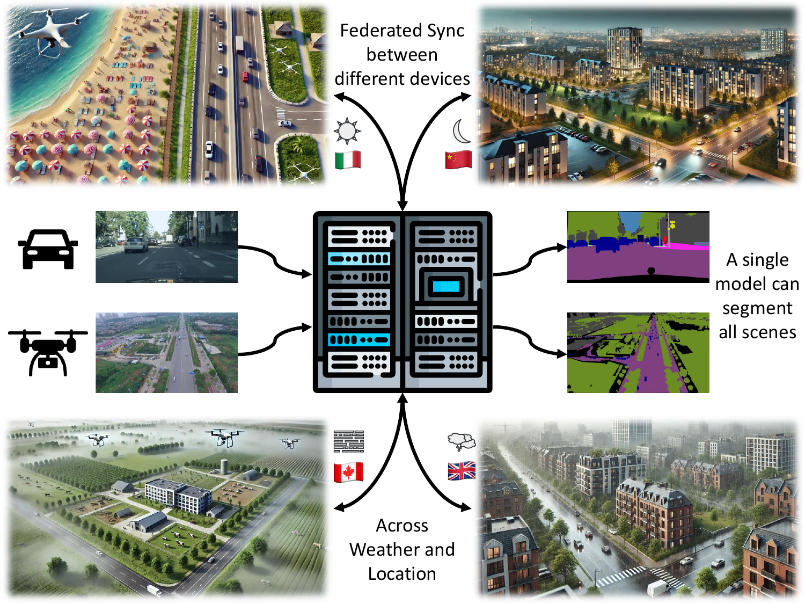

# When Cars meet Drones: Hyperbolic Federated Learning for Source-Free Domain Adaptation in Adverse Weather

**Official implementation** of the paper "[When Cars meet Drones: Hyperbolic Federated Learning for Source-Free Domain Adaptation in Adverse Weather](https://arxiv.org/abs/2403.13762)" accepted at WACV 2025.



## Summary

In Federated Learning (FL), multiple clients collaboratively train a global model without sharing private data. In semantic segmentation, the Federated source Free Domain Adaptation (FFREEDA) setting is of particular interest, where clients undergo unsupervised training after supervised pretraining at the server side. While few recent works address FL for autonomous vehicles, intrinsic real-world challenges such as the presence of adverse weather conditions and the existence of different autonomous agents are still unexplored. To bridge this gap, we address both problems and introduce a new federated semantic segmentation setting where both car and drone clients co-exist and collaborate. Specifically, we propose a novel approach for this setting which exploits a batch-norm weather-aware strategy to dynamically adapt the model to the different weather conditions, while hyperbolic space prototypes are used to align the heterogeneous client representations. Finally, we introduce FLYAWARE, the first semantic segmentation dataset with adverse weather data for aerial vehicles.

## Setup

### Setup the environment

1. Clone the repository.
2. Create the hyperflaw conda environment using the provided environment.yml file.

    ```bash
    conda env create -f extras/environment.yml
    conda activate hyperflaw
    ```

### Download the datasets

Pretrain datasets:

- Download the [SELMA](https://scanlab.dei.unipd.it/selma-dataset/) dataset from the [official website](https://scanlab.dei.unipd.it/app).

  - Register to the portal and go to the download page;
  - Select `Computer Vision`;
  - In `Slect Towns` choose `Select All`;
  - In `Select sensors` choose `CAM_DESK` and `SEGCAM_DESK`;
  - Then perform two separate downloads:
    1. `Select Weather` -> `Clear` | `Select Time` -> `Night`;
    2. `Select Weather` -> `Clear`, `HardRain`, `MidFog` | `Select Time` -> `Noon`.
  - Put all the downloaded folders inside a single folder named `SELMA`

- Download the FLYAWARE-S dataset from [here](https://medialab.dei.unipd.it/paper_data/HyperFLAW/FLYAWARE/FLYAWARE-S) and extract it.

    You must download all the parts of the zip file that you find in the provided link.
    On Linux, you can extract the multi-part zip file using the following command:

    ```bash
    zip -F FLYAWARE-S.zip --out combined.zip
    unzip combined.zip
    rm combined.zip
    ```

    This dataset is derived from [Syndrone](https://github.com/LTTM/Syndrone) dataset. We have enhanced it by adding different weather conditions. All rights are retained by the original authors of the datasets.

Clients datasets:

- Download the modified version of [ACDC](https://acdc.vision.ee.ethz.ch/) from [here](https://medialab.dei.unipd.it/paper_data/HyperFLAW/HyperFLAW-ACDC.zip) and extract it.

    This dataset is a modified version of the original [ACDC](https://acdc.vision.ee.ethz.ch/) dataset. We have changed the splits to consider different weather and we have added some images from the [Cityscapes](https://www.cityscapes-dataset.com/) dataset to include clear noon weather. All rights are retained by the original authors of the datasets.

- Download the FLYAWARE-R dataset from [here](https://medialab.dei.unipd.it/paper_data/HyperFLAW/FLYAWARE/FLYAWARE-R.zip) and extract it.

    This dataset is derived from the [UAVid](https://uavid.nl/) dataset. We have enhanced it to generate different weather conditions starting from the provided images. All rights are retained by the original authors of the datasets.

- Download the FLYAWARE-R-XL dataset from [here](https://medialab.dei.unipd.it/paper_data/HyperFLAW/FLYAWARE/FLYAWARE-R-XL.zip) and extarct it.

    This dataset is derived from the FLYAWARE-R dataset with the addition of some enhanced images from [Visdrone](https://github.com/VisDrone/VisDrone-Dataset) dataset. All rights are retained by the original authors of the datasets.

Before running the code put all the datasets in the same folder (for example `datasets`), the path to this folder will become the `root_dir` parameter in the config file.

The final folder structure of the datasets should look like the following:

```
datasets
├── SELMA
│   ├── Town01_Opt_ClearNight
│   │   ├── CAM_DESK
│   │   │   ├── Town01_Opt_ClearNight_5300274882951739.jpg
│   │   │   ...
│   │   │   └── Town01_Opt_ClearNight_18438957881020911553.jpg
│   │   └── SEGCAM_DESK
│   │       ├── Town01_Opt_ClearNight_5300274882951739.png
│   │       ...
│   │       └── Town01_Opt_ClearNight_18438957881020911553.png
│   ...
│   └── Town10HD_Opt_MidFoggyNoon
│       └── ...
├── FLYAWARE-S
│   ├── renders
│   │   ├── Town01_Opt_120
│   │   │   ├── ClearNight
│   │   │   │   ├── bboxes
│   │   │   │   │   ├── 00000.json
│   │   │   │   │   ...
│   │   │   │   │   └── 02999.json
│   │   │   │   ├── height20m
│   │   │   │   │   ├── camera
│   │   │   │   │   │   ├── 00000.json
│   │   │   │   │   │   ...
│   │   │   │   │   │   └── 02999.json
│   │   │   │   │   ├── depth
│   │   │   │   │   │   ├── 00000.png
│   │   │   │   │   │   ...
│   │   │   │   │   │   └── 02999.png
│   │   │   │   │   ├── rgb
│   │   │   │   │   │   ├── 00000.png
│   │   │   │   │   │   ...
│   │   │   │   │   │   └── 02999.png
│   │   │   │   │   └── semantic
│   │   │   │   │       ├── 00000.png
│   │   │   │   │       ...
│   │   │   │   │       └── 02999.png
│   │   │   ├── ClearNoon
│   │   │   │   └── ...
│   │   │   ├── HardRainNoon
│   │   │   │   └── ...
│   │   │   └── MidFoggyNoon
│   │   │       └── ...
│   │   ├── ...
│   │   └── Town10HD_Opt_120
│   ├── trajectories
│   │   ├── keyframes_Town01_Opt_120.csv
│   │   ...
│   │   └── keyframes_Town10HD_Opt_120.csv
│   ├── test.txt
│   └── train.txt
├── FLYAWARE-R
│   ├── gt
│   │   ├── day
│   │   │   ├── test
│   │   │   │   ├── 00000.png
│   │   │   │   ...
│   │   │   │   └── 00068.png
│   │   │   └── train
│   │   │       ├── 00000.png
│   │   │       ...
│   │   │       └── 00199.png
│   │   ├── fog
│   │   │   └── ...
│   │   ├── night
│   │   │   └── ...
│   │   └── rain
│   │       └── ...
│   ├── rgb
│   │   ├── day
│   │   │   ├── test
│   │   │   │   ├── 00000.png
│   │   │   │   ...
│   │   │   │   └── 00068.png
│   │   │   └── train
│   │   │       ├── 00000.png
│   │   │       ...
│   │   │       └── 00199.png
│   │   ├── fog
│   │   │   └── ...
│   │   ├── night
│   │   │   └── ...
│   │   └── rain
│   │       └── ...
│   └── splits
│       ├── heterogeneous
│       │   ├── test
│       │   │   └── test_user.json
│       │   └── train
│       │       └── clients.json
│       └── homogeneous_only_clear
│           └── ...
└── FLYAWARE-R-XL
    ├── gt
    │   └── ...
    ├── rgb
    │   └── ...
    └── splits
        └── ...
```

### Experiments' logging

Make a new [wandb](https://wandb.ai/site) account if you do not have one yet, and create a new wandb project.
> [!TIP]
> Look at the wandb ID generated for the project since you'll need it to log the experiments.

## Run the code

The code is subdivided into two parts:

1. [`01_pretrain`](./01_pretrain): Contains all the code required to perform the pretrain phase of the model on the server side.
2. [`02_adaptation`](./02_adaptation): Contains all the code required to perform the adaptation phase of the model on the client side in a federated fashion.

For this reason, there are two different run scripts: `run_pretrain.sh` and `run_adaptation.sh` that are required to perform the pre-train or the adaptation respectively.

> [!WARNING]
> The provided code was developed and tested only on Linux machines we cannot guarantee successful execution on other platforms.

### Re-run the experiments

To re-run the experiments reported in the paper, you can use the provided config files in the `configs` folder. More specifically, you can use the following command to run the pre-train phase:

- pre-train phase on SELMA and FLYAWARE-S dataset:

    ```bash
    conda activate hyperflaw # if not already activated
    ./run_pretrain.sh configs/pretrain_server.txt
    ```
  
- adaptation phase on ACDC, and FLYAWARE-R-XL dataset:

    ```bash
    conda activate hyperflaw # if not already activated
    ./run_adaptation.sh configs/adaptation.txt
    ```
  
- evaluation only on the final model:

    ```bash
    conda activate hyperflaw # if not already activated
    ./run_adaptation.sh configs/evaluation.txt
    ```

> [!IMPORTANT]
> Before running the code open the configs you need and add your `wandb_id` and `root_dir` (the path to the datasets folder).

> [!NOTE]
> Remember that if you need in the [`checkpoints`](./checkpoints) you can find the checkpoint for both the pre-train and the complete model.

### Run the code with a custom configuration

1. Create a new config file (```.txt```) where each line corresponds to a parameter in the following format: ```parameter_name=parameter_value```.
2. Run the code using the following command:

    ```bash
    conda activate hyperflaw # if not already activated
    ./run.sh config_file_path
    ```

## Citation

If you find this work useful, please cite us:

```bibtex
@inproceedings{rizzoli2024cars,
    title={When Cars meet Drones: Hyperbolic Federated Learning for Source-Free Domain Adaptation in Adverse Weather},
    author={Rizzoli, Giulia and Caligiuri, Matteo and Shenaj, Donald and Barbato, Francesco and Zanuttigh, Pietro},
    booktitle={Winter Conference on Applications of Computer Vision (WACV)},
    year={2025},
    organization={IEEE} 
}
```

If you use one of ours dataset please cite also:

```bibtex
@inproceedings{rizzoli2023syndrone,
    title={Syndrone-multi-modal uav dataset for urban scenarios},
    author={Rizzoli, Giulia and Barbato, Francesco and Caligiuri, Matteo and Zanuttigh, Pietro},
    booktitle={Proceedings of the IEEE/CVF International Conference on Computer Vision},
    pages={2210--2220},
    year={2023}
}
```
